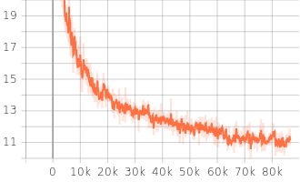
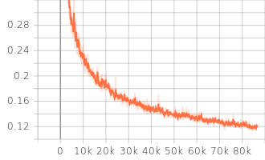
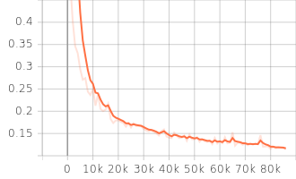

# BemaGANv2: A Vocoder with Superior Periodicity Capture for Long-Term Audio Generation

### Taesoo Park, Mungwi Jeong, Mingyu Park, Narae Kim, Junyoung Kim, Soonchul Kwon, Jisang Yoo

In our [paper](https://ieeexplore.ieee.org/abstract/document/10920769), We propose BemaGANv2: a GAN-based vocoder optimized for long-term audio generation, leveraging Snake activation and multi-discriminator architectures for enhanced periodicity and fidelity. <br/>
We provide our implementation and pretrained models as open source in this repository.

**Abstract :**
This paper introduces BemaGANv2, an advanced model built upon the BemaGAN architecture. BemaGANv2 enhances the Generator and extends the discriminator framework to more effectively capture long-term audio dependencies and periodicity. By applying the Snake function as the activation function in the Generator, the model improves its ability to handle audio extrapolation and periodicity. Additionally, the envelope extraction method in the MED has been refined, and the combination of the discriminator in the existing BemaGAN has been changed from the MED+MPD to the MED+MRD structure. Experiments with various discriminator combinations, including MSD+MED, MSD+MRD, and MPD+MED+MRD, validate the effectiveness of BemaGANv2. The final BemaGANv2 model serves as a vocoder in Text-to-Audio (TTA) or Text-to-Music (TTM) tasks to restore the original audio, aiming to enhance the fidelity and perceptual quality of generated long-term audio. Experimental results demonstrate that BemaGANv2 outperforms the previous model in both objective and subjective evaluation metrics, making it more suitable for long-term audio generation.

----------

## Our settings

1. python = 3.9
2. Clone this repository.
3. Install requirements.txt

```bash
pip install -r requirements.txt
```

## dataset

Download and extract the [LJ Speech dataset](https://keithito.com/LJ-Speech-Dataset/).

And move all wav files to `LJSpeech-1.1/wavs0`

Run the code below.

```Python
import os
import glob

input_dir = "/Your path/LJSpeech-1.1/wavs0"
output_dir = "/Your path/LJSpeech-1.1/wavs"
os.makedirs(output_dir, exist_ok=True)

for file in glob.glob(f"{input_dir}/*.wav"):
    filename = os.path.basename(file)
    out_path = os.path.join(output_dir, filename)
    !ffmpeg -y -loglevel panic -i "{file}" -ar 24000 "{out_path}"
```

--------

## Training

```
python train.py --config config_v1.json
```

Checkpoints and copy of the configuration file are saved in `cp_BemaGanv2_MED_MRD` directory by default.<br>
You can change the path by adding `--checkpoint_path` option.

__Training gen loss total & mel spec error__

 

__validation mel spec error__



## Inference from wav file
1. Make `test_files` directory and copy wav files into the directory.
2. Run the following command.
    ```
    python inference.py --checkpoint_file [generator checkpoint file path]
    ```
Generated wav files are saved in `generated_files` by default.<br>
You can change the path by adding `--input_wavs_dir` , `--output_dir` option.

-------------------

---

**This repository was created with the participation of Capstone Design members from Kwangwoon University.**


Contributors:
- [Taesoo Park](https://github.com/dinhoitt)
- [Narae Kim](https://github.com/wing0529)
- [Mungwi Jeong](https://github.com/Jeongmungwi)
- [Mingyu Park](https://github.com/mingyu516)
- Junyoung Kim
