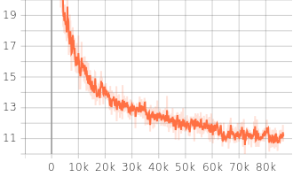
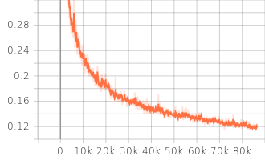
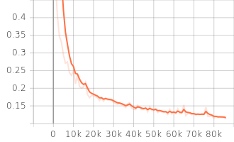

# BemaGANv2: A Vocoder with Superior Periodicity Capture for Long-Term Audio Generation

### Taesoo Park, Mungwi Jeong, Mingyu Park, Narae Kim, Junyoung Kim, Soonchul Kwon, Jisang Yoo

In our [paper](https://arxiv.org/abs/2506.09487), We proposed BemaGANv2: Discriminator Combination Strategies for GAN-based Vocoders in Long-Term Audio Generation <br/>
We provide our implementation and pretrained models as open source in this repository.

We provide our sample testset. [demoweb](https://dinhoitt.github.io/BemaGANv2.github.io)

**Abstract :**

This paper presents BemaGANv2, an advanced GAN-based vocoder designed for high-fidelity and long-term audio generation, with a focus on systematic evaluation of discriminator combination strategies. Long-term audio generation is critical for applications in Text-to-Music (TTM) and Text-to-Audio (TTA)systems, where maintaining temporal coherence, prosodic consistency, and harmonic structure over extended durations remains a significant challenge. Built upon the original BemaGAN architecture, BemaGANv2 incorporates major architectural innovations by replacing traditional ResBlocks in the generator with the Anti-aliased Multi-Periodicity composition (AMP) module, which internally applies the Snake activation function to better model periodic structures. In the discriminator framework, we integrate the Multi-Envelope Discriminator (MED), a novel architecture we proposed, to extract rich temporal envelope features crucial for periodicity detection. Coupled with the Multi-Resolution Discriminator (MRD), this combination enables more accurate modeling of long-range dependencies in audio. We systematically evaluate various discriminator configurations, including Multi-Scale Discriminator (MSD) + MED, MSD + MRD, and Multi-Period Discriminator (MPD) + MED + MRD, using objective metrics (Fréchet Audio Distance (FAD), Structural Similarity Index (SSIM), Pearson Correlation Coefficient (PCC), Mel-Cepstral Distortion (MCD), MultiResolution STFT (M-STFT), Periodicity error (Periodicity)) and subjective evaluations (MOS, SMOS). To support reproducibility, we provide detailed architectural descriptions, training configurations, and complete implementation details. The code, pre-trained models, and audio demo samples are available at: https://github.com/dinhoitt/BemaGANv2.

----------

## Our settings

1. python = 3.9
2. Clone this repository.
3. Install requirements.txt

```bash
pip install -r requirements.txt
```

## dataset

Download and extract the [LJ Speech dataset](https://keithito.com/LJ-Speech-Dataset/).

And move all wav files to `LJSpeech-1.1/wavs0`

Run the code below.

```Python
import os
import glob

input_dir = "/Your path/LJSpeech-1.1/wavs0"
output_dir = "/Your path/LJSpeech-1.1/wavs"
os.makedirs(output_dir, exist_ok=True)

for file in glob.glob(f"{input_dir}/*.wav"):
    filename = os.path.basename(file)
    out_path = os.path.join(output_dir, filename)
    !ffmpeg -y -loglevel panic -i "{file}" -ar 24000 "{out_path}"
```

--------

## Training

```
python train.py --config config_v1.json
```

Checkpoints and copy of the configuration file are saved in `cp_BemaGanv2_MED_MRD` directory by default.<br>
You can change the path by adding `--checkpoint_path` option.

__Training gen loss total & mel spec error__

 

__validation mel spec error__



## Inference from wav file
1. Make `test_files` directory and copy wav files into the directory.
2. Run the following command.
    ```
    python inference.py --checkpoint_file [generator checkpoint file path]
    ```
Generated wav files are saved in `generated_files` by default.<br>
You can change the path by adding `--input_wavs_dir` , `--output_dir` option.

-------------------

---

**This repository was created with the participation of Capstone Design members from Kwangwoon University.**


Contributors:
- [Taesoo Park](https://github.com/dinhoitt)
- [Narae Kim](https://github.com/wing0529)
- [Mungwi Jeong](https://github.com/Jeongmungwi)
- [Mingyu Park](https://github.com/mingyu516)
- Junyoung Kim
